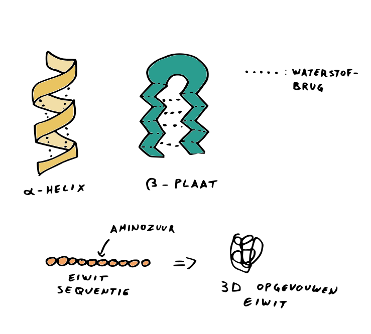
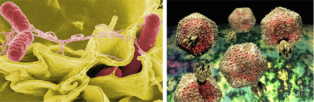
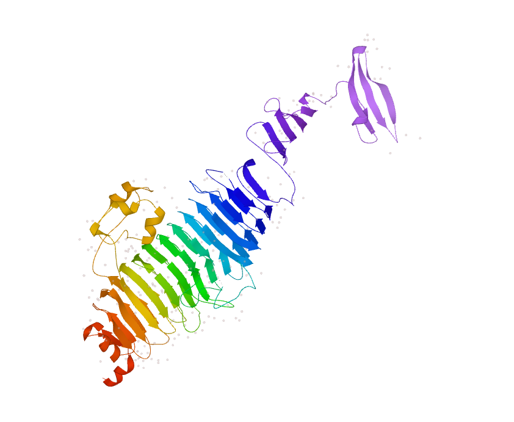
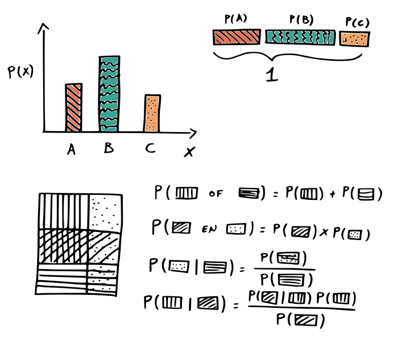
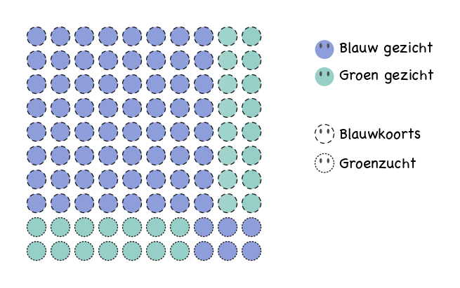
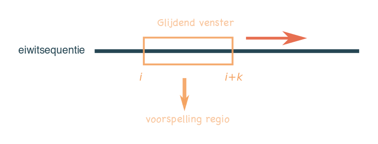
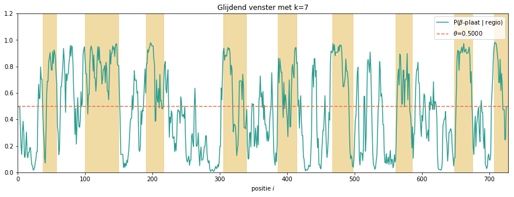

# Eiwitten beter begrijpen met kansberekening

In dit project zullen we kansrekening gebruiken om de secundaire structuur ($\beta$-platen) van een eiwit te voorspellen. We overlopen eerst de basisregels van kansrekening en dan zullen we een vereenvoudiging doorvoeren om het rekenen mogelijk te maken. Zo bekomen we een data-gedreven model om voor een aminozuur de kans te berekenen of dit waarschijnlijk in $\beta$-plaat voorkomt of niet. Dit zullen we toepassen over volledige eiwitten via de glijdend venster methode. Ten slotte hebben we het kort even hebben over modelevaluatie: hoe betrouwbaar is zo'n model?

## Een beetje achtergrond

### De wereld van eiwitten en hun opbouw

Eiwitten vormen één van de meest belangrijke klassen van biologische moleculen. Eiwitten vervullen actieve rollen en blijken essentieel te zijn voor zowat alle biologische processen in een levend organisme: ze staan in voor het verteren van voedsel, zorgen voor ontgifting, geven informatie door, maken beweging mogelijk en nog veel meer. Zo vormen ze een fundamenteel onderdeel van biologisch wezen.

De opbouw van een eiwit is relatief simpel. Net zoals DNA is een eiwit een *polymeer*: een lange streng van meer eenvoudige moleculen. Deze eenvoudige moleculen worden *aminozuren* genoemd, waarvan er in de natuur 20 verschillenden voorkomen, elk voorgesteld door een hoofdletter. Een specifieke opeenvolging van zo'n aminozuren wordt de *primaire structuur* van een eiwit genoemd. Deze primaire structuur bepaalt hoe het eiwit zich verder zal opvouwen (in een functionele 3D-structuur) en legt de biologische functie van een eiwit vast.

Uit de primaire structuur van eiwitten volgt de *secundaire structuur*. Deze structuren onstaan door waterstofbruggen (niet-covalente bindingen tussen vrije waterstoffen en hydroxylgroepen) tussen naburige aminozuren. De belangrijkste secundaire structuren zijn *$\alpha$-helices* en *$\beta$-platen* (Engels: $\beta$-sheets). Gegeven dat deze secundaire structuur enkel door de primaire structuur bepaald wordt, kunnen we wiskunde gebruiken om de secundaire structuur te voorspellen[^structuur].

[^structuur]: Naast de primaire en secundaire structuur hebben eiwitten doorgaans ook en *tertiaire* en *quaternaire* structuur. De tertiaire structuur is de globale opvouwing van het eiwit en is veel (veeeeeeeeel) moeilijker om computationeel te bepalen. De quaternaire structuur omvat hoe verschillende eiwitten samen een groter complex vormen.

### Stoute bacteriën en goede virussen

Zelfs de allerkleinste biologische entiteiten, de virussen, gebruiken eiwitten voor infectie en aldus om zich te kunnen vermenigvuldigen. Een zeer interessante groep virussen zijn de bacteriofagen of kortweg fagen. Dit zijn virussen die bacteriën infecteren en aldus ook kunnen afdoden. Bacteriën, en dus ook fagen, komen overvloedig voor in ons lichaam. Vele bacteriën zijn goedaardig en helpen ons lichaam optimaal functioneren. Soms dringen echter pathogene bacteriën ons lichaam binnen en maken ze ons ziek. *Salmonella enterica* is zo’n bacterie. *Salmonella* dringt ons lichaam binnen via besmet voedsel: de bacterie kan overleven op onvoldoende verhitte eieren en vlees, alsook op rauwe groenten en fruit. Eens de bacterie zich in onze darmen bevindt, kan ze ons ernstig ziek maken.

Een bijkomend probleem is dat *Salmonella* en andere bacteriën steeds meer resistent worden tegen antibiotica. Gelukkig kunnen we ook fagen inzetten om bacteriën te bestrijden! Cruciaal voor een faag bij het infecteren van zijn bacteriële gastheer zijn specifieke faag eiwitten die componenten van de salmonellabacterie herkennen. Deze faag eiwitten verschillen vaak tussen verschillende salmonellafagen. Door deze verschillen kunnen fagen aldus verschillende varianten van de *Salmonella* bacterie herkennen. Anderzijds komt er tussen verschillende salmonellafagen ook vaak een geconserveerd eiwitdomein voor. Dit is een stukje van het eiwit dat wel hetzelfde is tussen de verschillende salmonellafagen. Bij salmonellafagen is dit een zogenaamd $\beta$-helicaal domein. Dit domein vormt als het ware een *moleculaire boor* die de celwand van de bacterie kan doorboren, wat nodig is om de infectie te starten. Door zo'n faag eiwitten beter te begrijpen kunnen we ze daarna ook beter inzetten tegen gevaarlijke bacteriën.

Een voorbeeld van zo'n faag eiwit is het staarteiwit van Salmonellafaag P22: [*P12528*](https://www.uniprot.org/uniprot/P12528). Tussen aminozuur 140 en 543 bevindt zich een groot $\beta$-helicaal domein (bestaande uit parallele $\beta$-platen) dat een puntig einde heeft rond aminozuur 113. De aanwezigheid van die $\beta$-platen is belangrijk voor de specifieke functie van het eiwit. Deze secundaire structuren (de $\beta$-platen) kunnen we bestuderen via wiskunde en computers. Dit onderzoeksdomein noemen we *bio-informatica*. In bio-informatica wordt wiskunde gecombineerd met computerkracht om interessante biologische fenomenen te bestuderen en biologische problemen op te lossen.

In dit project zetten we de computer aan het werk om eiwitten te bestuderen. Zo'n eiwitten bestuderen wetenschappers vaak op basis van de aminozuursequentie van het eiwit. Door specifieke instructies te geven aan de computer kunnen we voorspellingen maken voor $\beta$-platen om zo de $\beta$-helicale domeinen te vinden! In dit project zullen we de computer leren om dergelijke voorspellingen te maken. Hieronder bekijken we eerst welke wiskunde je daar net voor nodig hebt.

## Rekenen met kansen en de regel van Bayes

### Kansrekening in een notendop

Kansrekening of probabiliteitstheorie is de tak van de wiskunde die zich bezig houdt met *kansen*. Met kansen kom je dagelijks in contact, denk maar aan gezelschapsspellen waarbij je moet dobbelen of Frank Deboosere die aangeeft dat er 60%[^procent] kans op neerslag is voor morgen. Er zijn nog vele andere voorbeelden, en net omdat kansberekenen zo belangrijk is in het dagelijkse leven, is het interessant om dit te bestuderen.

[^procent]: Vergeet niet bij het rekenen dat 60% = 0.60.

Er zijn enkele fundamentele regels die steeds gelden bij het berekenen van kansen. De figuur eronder stelt deze regels visueel voor:

1. De kans van een gebeurtenis is een positief getal of 0[^positievekansen].
2. De totale kans dat er *een* gebeurtenis plaatsvindt is 1 (honderd procent)[^normaliserenkans].
3. (**somregel**) De kans dat een van twee elkaar uitsluitendende gebeurtenissen plaatsvindt is de som van de kansen van die gebeurtenissen[^uitsluitendekansen].
4. (**productregel**) Zijn twee gebeurtenissen echter *onafhankelijk* van elkaar dan is de kans dat beide gebeurtenissen samen plaatsvinden het product van die kansen[^onafhkansen].
5. Er bestaan *conditionele* kansen, dit is de kans dat een gebeurtenis $A$ plaatsvindt gegeven een gebeurtenis $B$. De conditionele kans[^condkansen] wordt berekend als: $$P(A\mid B) = \frac{P(A \text{ en } B)}{P(B)}\,.$$
7. Met de *regel van Bayes* kunnen we via de informatie van een gebeurtenis kansen berekenen voor een andere gebeurtenis. De formule wordt hieronder gegeven voor gebeurtenissen A en B: $$
P(A\mid B) = \frac{P(B \mid A) P(A)}{P(B)}\,.
$$

[^positievekansen]: Bijvoorbeeld, de kans op een 6 gooien met een zesogige dobbelsteen is 1/6.
[^normaliserenkans]: De som van de kansen van alle mogelijke uitkomsten van een worp van een dobbelsteen is 1/6+1/6+...+1/6=1.
[^uitsluitendekansen]: Bijvoorbeeld, met een dobbelsteen gooien kan je nooit én een even getal gooien (kans van 3/6=1/2) én een drie gooien (kans van 1/6). De kans op één van beide gebeurtenissen is 3/6+1/6=4/6=2/3.
[^onafhkansen]: Bijvoorbeeld, de kans dat je bij twee opeenvolgende worpen van een dobbelsteen twee keer een zes gooit is $1/6\cdot1/6=1/36$.
[^condkansen]: Bijvoorbeeld, de kans dat we met een dobbelsteen een zes gooien gegeven dat het een even getal was is $(1/6)/(1/2)=1/3$.

> **Oefening 1:** Je wordt op een nacht rillend van de koorts wakker. Je geeft over en hebt overal jeuk. Er zijn twee ziekten met deze symptomen: blauwkoorts en groenzucht. De ene ziekte komt vaker voor dan de andere: wie ziek is heeft in 80% van de gevallen last van blauwkoorts, terwijl groenzucht slechts in 20% van de gevallen voorkomt. Zoals de naam doet vermoeden, hebben deze ziekten nog een ander, duidelijk zichtbaar symptoom. Mensen met blauwkoorts krijgen doorgaans een blauw gezicht en deze met groenzucht een groen gezicht. **In 20% van de gevallen krijgt een persoon met blauwkoorts een groen gezicht en in 30% van de gevallen krijgt iemand met groenkoorts een blauw gezicht!** Je spoedt je naar de spiegel en iemand met een groen gezicht staart terug. Welke ziekte heb je? Bekijk onderstaande figuur en vul de ontbrekende kansen in de tabel verder aan.

$$
P(\text{blauwkoorts}) = \ldots \quad\quad P(\text{groenzucht}) = \ldots
$$

 

| ziekte      | kans blauw gezicht | kans groen gezicht |
|:------------|:-------------------|--------------------|
| blauwkoorts | ...                | ...                |
| groenzucht  | ...                | ...                |

 

$$
P(\text{blauw gezicht}) = \ldots \quad\quad P(\text{groen gezicht}) = \ldots
$$

$$
P(\text{blauwkoorts} \mid \text{groen gezicht}) = \ldots\quad\quad P(\text{groenzucht} \mid \text{groen gezicht}) = \ldots
$$

### Naive Bayes

Nu we de regel van Bayes intuïtief begrijpen, kunnen we deze toepassen voor het voorspellen van $\beta$-platen in eiwitten. De *naive Bayes*-methode kan hiervoor gebruikt worden. Deze methode maakt gebruik van de regel van Bayes om voorspellingen te maken o.b.v. een gegeven input. In dit project willen we een $\beta$-plaat voorspellen o.b.v. de eiwitsequentie (de input).

De regel van Bayes kan voor dit geval als volgt geschreven worden:

$$
P(\beta\text{-plaat}\mid \text{eiwitsequentie}) = \frac{P(\text{eiwitsequentie} \mid \beta\text{-plaat})P(\beta\text{-plaat}) }{P(\text{eiwitsequentie})}
$$

De eerste kans in de breuk kunnen we wat herschrijven als:

$$
P(\text{eiwitsequentie} \mid \beta\text{-plaat})=P(A_1A_2\ldots A_n\mid \beta\text{-plaat})\,.
$$

Hierboven schrijven we dus de eiwitsequentie gewoon als de opeenvolging van de $n$ aminozuren. Hier stelt $A_i$ de identiteit voor van het aminozuur op positie $i$. Hoe berekenen we de kans op een gegeven sequentie? Voor een stukje met lengte $n=10$ hebben we $20^{10}= 10240000000000\approx 10^{13}$ unieke sequenties. In een probabilistisch model moeten we dus een vereenvoudiging doorvoeren!

\bigskip

> **Vereenvoudiging:** We gaan ervan uit dat de kans dat een bepaald aminozuur op een bepaalde plaats voorkomt **onafhankelijk is van de aminozuren op elke andere plaats** (ergens huilt er een moleculair bioloog).

\bigskip

Deze vereenvoudiging is natuurlijk volstrekt biologisch onrealistisch! De aminozuren zijn in werkelijkheid juist erg afhankelijk, bijvoorbeeld omdat twee aminozuurtjes met elkaar in contact komen en een waterstofbrug vormen. Hoe fout deze vereenvoudiging ook is, ze is echter wel nuttig!

\pagebreak

Het laat ons toe om de kansen voor een $\beta$-plaat redelijk goed te benaderen! In formulevorm is deze veronderstelling voor ons probleem[^conditioneelvereenvoudiging][^productnotatie]:

[^conditioneelvereenvoudiging]: On helemaal precies te zijn, de veronderstelling zegt dat $P(A_1A_2\ldots A_n)\approx P(A_1)P(A_2)\ldots P(A_n)$, wat zegt dat aminozuren onafhankelijk zijn. Wij gebruiken de identiteit $P(A_1A_2\ldots A_n\mid \beta\text{-plaat})\approx P(A_1\mid \beta\text{-plaat})P(A_2\mid \beta\text{-plaat})\ldots P(A_n\mid \beta\text{-plaat})$, wat zegt dat aminozuren onafhankelijk zijn binnen een $\beta$-plaat. Deze twee uitspraken zijn **niet** inwisselbaar!

[^productnotatie]: Hier maken we gebruik van de notatie voor een product: $\prod_{i=1}^n x_i=x_1 x_2\ldots x_n\,,$ (bv. $\prod_{i=2}^4 i = 2\times 3\times 4=24$).

$$
P(\text{eiwitsequentie} \mid \beta\text{-plaat})\approx P(A_1\mid\beta\text{-plaat})P(A_2\mid\beta\text{-plaat})\ldots P(A_n\mid\beta\text{-plaat})
$$
$$
= \prod_{i=1}^n P(A_i\mid\beta\text{-plaat})
$$

Uiteindelijk kunnen we de regel van Bayes dus als volgt noteren om $\beta$-platen te voorspellen:

$$
P( \beta\text{-plaat} \mid \text{eiwitsequentie} ) \approx P(\beta\text{-plaat}) \prod_{i=1}^n \frac{P(A_i\mid\beta\text{-plaat})}{P(A_i)}\,.
$$

We kunnen de kans op een $\beta$-plaat gegeven een sequentie dus berekenen aan de hand van termen die we makkelijk uit data kunnen schatten door te tellen! De kans dat het aminozuur voorkomt in een $\beta$-plaat gedeeld door de kans dat dat aminozuur in een willekeurig eiwit voorkomt wordt de **odds** (Nederlands: *kansverhouding*) genoemd. Hoewel we dit hier niet zullen doen, is het misschien ook wel belangrijk te vermelden dat in de praktijk de logaritme[^logaritme] van deze kansen genomen wordt om de berekeningen te vereenvoudigen.

> **Vraag:** Wanneer zou je stellen dat een regio waarschijnlijk een $\beta$-plaat is?

[^logaritme]: De logaritme met basis 10 wordt gedefineerd als: $$\log_{10}x=y \Longleftrightarrow 10^y=x\,.$$ Herinner je dat voor positieve getallen $a$ en $b$ geldt dat $\log(ab)=\log(a) + \log(b)$ en $\log(a/b)=\log(a) - \log(b)$. Wetenschappers gebruiken logaritmen vaak om vermenigvuldigingen in sommen om te zetten. Het voordeel met logaritmen is dat heel kleine getallen door vermenigvuldiging in negatieve waarden omgezet worden.

### Een eenvoudig voorbeeld met de hand uitwerken

Nu kunnen we de bovenstaande formule gebruiken om voorspellingen te maken voor eiwitten. Vooraleer we deze formule doorgeven aan de computer zullen we ze eerst zelf op papier eens toepassen. Hiervoor hebben we volgende kansen nodig (rechterlid van de bovenstaande formule):

- $P(A_i)$: de probabiliteiten van het voorkomen van elk aminozuur $A_i$.
- $P(\beta\text{-plaat})$: de kans om een $\beta$-plaat waar te nemen.
- $P(A_i\mid\beta\text{-plaat})$: de kans om een bepaald aminozuur waar te nemen, gegeven dat de sequentie een $\beta$-plaat is.

\pagebreak

> **Oefening 2:** Onderstaande tabel bevat experimenteel bepaalde aminozuur (AZ) aantallen van een staarteiwit van een faag die we zullen gebruiken om voorspellingen te maken. Op basis van de aantallen en het totaal aantal aminozuren kan je de ontbrekende kansen in de tabel berekenen, alsook de kans op een $\beta$-plaat. Deze kansen heb je nodig om de formule uit te werken. Vervolledig deze tabel.

| AZ         | totaal aantal | $\mathbf{P(A_i)}$ | aantal in $\beta$-plaat | $\mathbf{P(A_i\mid\beta\text{-plaat})}$ | $\mathbf{\frac{P(A_i\mid \beta\text{-plaat})}{P(A_i)}}$ |
|:-----------|:--------------|:------------------|:------------------------|:----------------------------------------|:--------------------------------------------------------|
| A          | 48            | ...               | 21                      | ...                                     | ...                                                     |
| C          | 8             | 0.0120            | 2                       | 0.0060                                  | 0.5038                                                  |
| D          | 48            | ...               | 19                      | ...                                     | ...                                                     |
| E          | 22            | ...               | 11                      | ...                                     | ...                                                     |
| F          | 25            | 0.0375            | 13                      | 0.0393                                  | 1.0479                                                  |
| G          | 71            | 0.1064            | 29                      | 0.0876                                  | 0.8231                                                  |
| H          | 10            | 0.0150            | 4                       | 0.0121                                  | 0.8060                                                  |
| I          | 51            | ...               | 36                      | ...                                     | ...                                                     |
| K          | 34            | ...               | 12                      | ...                                     | ...                                                     |
| L          | 49            | 0.0735            | 30                      | 0.0906                                  | 1.2337                                                  |
| M          | 9             | 0.0135            | 6                       | 0.0181                                  | 1.3434                                                  |
| N          | 41            | 0.0615            | 18                      | 0.0544                                  | 0.8847                                                  |
| P          | 28            | 0.0420            | 7                       | 0.0211                                  | 0.5038                                                  |
| Q          | 22            | 0.0330            | 9                       | 0.0272                                  | 0.8244                                                  |
| R          | 23            | 0.0345            | 14                      | 0.0423                                  | 1.2266                                                  |
| S          | 50            | ...               | 25                      | ...                                     | ...                                                     |
| T          | 46            | 0.0690            | 23                      | 0.0695                                  | 1.0076                                                  |
| V          | 48            | 0.0720            | 31                      | 0.0937                                  | 1.3014                                                  |
| W          | 7             | 0.0105            | 2                       | 0.0060                                  | 0.5757                                                  |
| Y          | 27            | ...               | 19                      | ...                                     | ...                                                     |
| **Totaal** | **667**       | -                 | **331**                 | -                                       | -                                                       |

Dus is  de kans op een $\beta$-plaat gelijk aan:
$$
P(\beta\text{-plaat}) = \ldots
$$

> **Oefening 3:** Volgende korte sequentie is een klein deeltje van het P22 staarteiwit: 'YSIEADKK'. Experimenteel werd reeds bepaald dat dit geen $\beta$-plaat is, maar een $\alpha$-helix. Bereken nu via de laatst geziene formule de kans dat die sequentie een $\beta$-plaat bevat (deze kans zou klein moeten zijn). Maak gebruik van de tabel met kansen die je net hebt ingevuld.

| $i$ | $A_i$ | $\frac{P(A_i\mid \beta\text{-plaat})}{P(A_i)}$ |
|:----|:------|:---------------------------------------------------------------------|
| 1   | ...   | ...                                                                  |
| 2   | ...   | ...                                                                  |
| 3   | ...   | ...                                                                  |
| 4   | ...   | ...                                                                  |
| 5   | ...   | ...                                                                  |
| 6   | ...   | ...                                                                  |
| 7   | ...   | ...                                                                  |
| 8   | ...   | ...                                                                 |

 

Dus is de conditionele kans op een $\beta$-plaat gegeven de eiwitsequentie bij benadering gelijk aan:
$$
P(\beta\text{-plaat}\mid\text{eiwitsequentie}) \approx\ldots
$$

## Naive Bayes op de computer

### Glijdende vensters en drempelwaarden

In het computerdeel van dit practicum gaan we nu de Naive Bayes-methode toepassen op het volledige P22 eiwit dat we eerder besproken hebben. Het doel is om te ontdekken waar de $\beta$-platen zich in het eiwit bevinden. We zullen $\beta$-platen voorspellen met behulp van de Naive Bayes-methode en de voorspellingen (i.e. de kansen) dan voorstellen via een grafiek. Hiervoor bewegen we aminozuur voor aminozuur over het eiwit via een *glijdend venster* van lengte $k$. In dit glijdend venster kijken we naar de aminozuren op elke positie van $i$ tot $i+k$ en vermenigvuldiging alle odds voor elk aminzozuur. We noteren dit als

$$
s^k_i = P(\beta\text{-plaat})\prod_{j=i}^{i+k}\frac{P(A_j\mid\beta\text{-plaat})}{P(A_j)}\,.
$$

In elke stap (voor elk glijdend venster) maken we een voorspelling die we later visueel kunnen voorstellen in een plot.

Eerder hebben we gesteld dat we een regio als een $\beta$-plaat classificeren indien

$$
P(\beta\text{-plaat}\mid \text{eiwitsequentie}) > 0.5\,.
$$

We willen dit echter veralgemenen zodat we strenger of minder streng kunnen zijn om secundaire structuren te vinden:

$$
P(\beta\text{-plaat}\mid \text{eiwitsequentie}) > \theta\,.
$$

Hier is $\theta$ een zorgvuldig gekozen *drempelwaarde* (Engels: threshold). De keuze van $\theta$ heeft gevolgen voor de correctheid van onze voorspellingen:

- als we $\theta$ te hoog kiezen is onze drempelwaarde te streng en zullen we dus bepaalde regio's niet als $\beta$-platen voorspellen terwijl dit eigenlijk wel $\beta$-platen zijn.
- als we $\theta$ te laag kiezen zijn we niet streng genoeg. We zullen dus regio's voorspellen als $\beta$-plaat dat eigenlijk geen $\beta$-plaat zijn.

Hieronder zie je een voorbeeld van een analyse met een glijdend venster.

Je kan dus inzien dat we de waarde van $\theta$ net goed willen kiezen zodat we het aantal foute voorspellingen tot een minimum beperken. Dit beperken van foute voorspellingen is altijd gewenst bij het gebruik van wiskundige modellen, en om deze fouten te bestuderen doen we aan *modelevaluatie*.

### Modelevaluatie: op welke manier is je model fout?

Wiskundige modellen maken zelden perfecte voorspellingen. Toch is het in de praktijk belangrijk dat modellen zeer accurate voorspellingen maken. Als bijvoorbeeld een zelfrijdende auto een foute voorspelling maakt over waar hij moet rijden kan dat mogelijks fataal zijn voor personen in de wagen en/of in de omgeving. Wanneer een wiskundig model voorspelt dat jij een kankergezwel hebt terwijl dat eigenlijk niet zo is, krijg je onnodig dure chemotherapie (die vaak ook slechte bijwerkingen heeft). Er zijn natuurlijk ook minder ernstige voorbeelden: wanneer het algoritme van Netflix je weer een serie aanraadt die je niet goed vindt, ga je naar die serie simpelweg niet beginnen kijken. Maar uiteraard wil ook Netflix zijn klanten de meest relevante films en series aanraden, en dat doen ze door continu voorspellingen te maken o.b.v. de series en films die jij al bekeken hebt en de grote hoeveelheid data die ze over hun andere klanten hebben.

Om inzicht te krijgen in hoe goed of hoe slecht een model voorspellingen maakt, zullen we het model evalueren: we bepalen hoe goed het model werkt op nieuwe data. Bij het voorspellen van secundaire structuren kan ons model slechts twee soorten voorspellingen maken: ofwel is de beschouwde regio onderdeel van een $\beta$-plaat ofwel is die dat niet. Het eerste noemen we een *positieve voorspelling*, het tweede een *negatieve voorspelling*. Deze terminologie is afkomstig uit de geneeskunde: een diagnostische test is positief als de persoon ziek is, en negatief als de persoon gezond is. In onze context hebben we echter geen voorkeur voor een positieve of negatieve voorspelling, we willen enkel correcte voorspellingen! Ons model kan twee soorten foute voorspellingen maken:

- Er werd foutief voorspeld dat een regio deel uit maakt van een $\beta$-plaat. Dit heet een **vals positieve** voorspelling (Engels: *false positive*).
- Een regio werd voorspeld als geen deel van een $\beta$-plaat terwijl dit in werkelijkheid wel zo is. Dit is een **vals negatieve** voorspelling (Engels: *false negative*).

De correcte en foute voorspellingen kunnen we eenvoudig voorstellen in een compacte tabel:

|                                          | **Voorspeld als $\beta$-plaat** | **Voorspeld als geen $\beta$-plaat** |
|:-----------------------------------------|:--------------------------------|:-------------------------------------|
| **Regio is deel van $\beta$-plaat**      | echt positief                   | vals negatief                        |
| **Regio is geen deel van $\beta$-plaat** | vals positief                   | echt negatief                        |
 

Beide foute voorspellingen zijn nauw verbonden met de keuze van de drempelwaarde $\theta$, alsook de grootte van het glijdend venster. In een laatste stap zullen we daarom de drempelwaarde $\theta$ en de grootte van het glijdend venster manueel aanpassen en het effect bestuderen op het aantal foute voorspellingen. Op die manier kunnen we $\theta$ en de grootte van het venster optimaal kiezen, om de foute voorspellingen tot een minimum te beperken.

### Stappenplan

Concreet zullen we de computer dus instructies geven om het volgende te doen:

1. Startend bij het begin van een eiwitsequentie maakt de computer een eerste voorspelling voor het stukje van de sequentie dat zich in het glijdend venster bevindt. Dit doet hij door Naive Bayes toe te passen en het stukje sequentie als $\beta$-plaat te voorspellen wanneer de berekende kans groter is dan de vooropgestelde drempelwaarde $\theta$.
2. Daarna schuift de computer het glijdend venster één aminozuur op in de sequentie en maakt een nieuwe voorspelling voor dit glijdend venster. Dit proces herhaalt de computer tot het einde van de eiwitsequentie bereikt is.
3. Voor elk glijdend venster slaat de computer de voorspelling op, zodat die later visueel voorgesteld kan worden.
4. We laten de computer de voorspellingen vergelijken met de werkelijke secundaire structuren, zodat we het model kunnen evalueren o.b.v. vals positieven en vals negatieven.
5. Als laatste stap veranderen we manueel de drempelwaarde $\theta$ en de grootte van het glijdend venster, om op die manier te proberen de vals positieven en vals negatieven tot een minimum te beperken.

> **Computeroefeningen:** Het glijdend venster om secundaire structuur te voorspellen is beschikbaar in een Jupyter notebook. Deze zijn beschikbaar via de website van de biowiskundedagen (http://www.biowiskundedagen.ugent.be/) of door op [*deze link*](https://mybinder.org/v2/gh/michielstock/biowiskundedagen/master) te klikken. Met die notebook kan je experimenteren met de grootte van het venster, de parameter $k$ en de drempelwaarde. Enkele vragen hierbij zijn de volgende: Welke invloed heeft de parameter $k$ als die groter wordt? Wat wil $k=1$ zeggen? Welke invloed heeft het verhogen en verlagen van de drempelwaarde op de verschillende types fouten? Kan je het aantal valse positieven (niet-$\beta$-platen die als $\beta$-plaat voorspeld worden) zo laag mogelijk krijgen? Hoe zorg je er voor dat je geen enkele $\beta$-plaat mist? Wat is het nadeel hiervan?

## En verder...

De concepten die je in deze praktische sessie geleerd hebt zijn eenvoudig en kunnen zeer nuttig zijn in de praktijk. Deze methode is een vereenvoudigede versie van de **Chou-Fasman** methode om secundaire structuren te voorspellen. Er bestaan echter ook veel complexere methoden om eiwitten te bestuderen. Misschien vind je onze methode van het glijdend venster nogal onelegant. Een veel krachtigere methode om secundaire structuren te bepalen is via *verborgen Markovketens* (Engels: Hidden Markov Chains) die op een slimme manier eiwit- en DNA-sequenties kunnen labellen.

Daarenboven staat onderzoek in de bio-informatica nooit stil en zijn er zelfs grote bedrijven in geïnteresseerd, net omdat computers ons veel kunnen bijleren over biologie. Een zeer recent voorbeeld is Deepmind, een bedrijf dat onder Google werkt. Recent werk van hen gebruikt complexe artificiële intelligentie om de tertiaire structuur van een eiwit accuraat te voorspellen. Hun ontwikkelde methode [*AlphaFold*](https://deepmind.com/blog/alphafold/) is de eerste in zijn soort, maar zal waarschijnlijk niet de laatste zijn. Net zoals we in dit project gedaan hebben, werd hierbij een model gefit aan een databank met geannoteerde voorbeelden. Wij hebben echter met een model gewerkt met een twintigtal parameters, in de praktijk zijn het er miljoenen of miljarden.

\pagebreak
