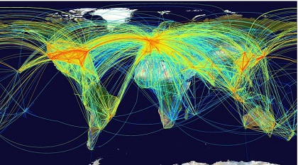
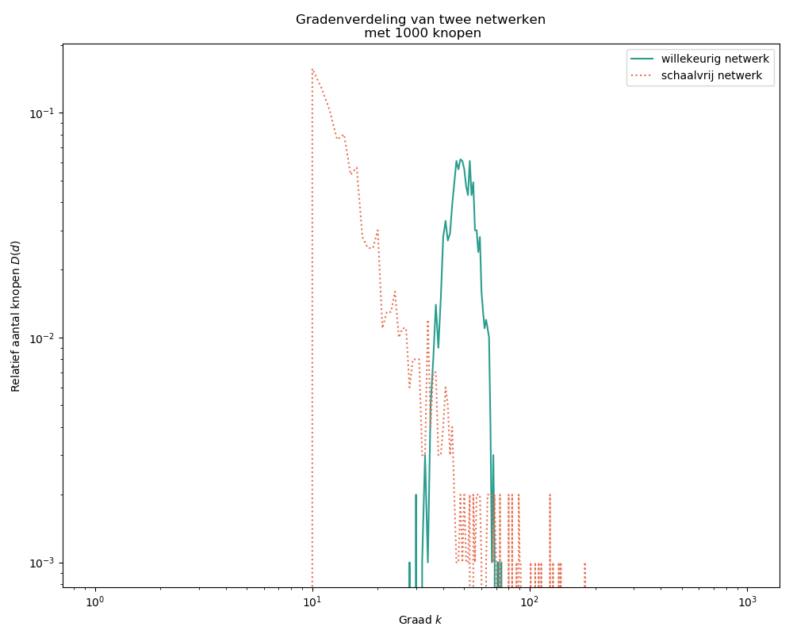

# Verspreiding van ziektes doorheen sociale netwerken

In dit project zullen we bestuderen hoe ziektes zich kunnen verspreiden via een (sociaal) netwerk. We zullen onderzoeken hoe de structuur van een netwerk een invloed kan hebben op hoe snel een ziekte doorgegeven wordt. Ten slotte zullen we het effect van vaccinatie bekijken.

## Besmettelijke ziektes

In de geschiedenis van de mensheid[^niethumaneziekten] heeft niets zoveel mensen gedood als besmettelijke ziekten. De ziekte die de meeste mensen heeft gedood is waarschijnlijk tuberculose, waarbij 1000 miljoen mensen in alleen de 19de en 20ste eeuw werden gedood. De ziekte die het snelst gedood heeft, is de 'Spaanse griep' epidemie die 50 tot 100 miljoen mensen heeft gedood tussen 1918 en 1920. De ziekte met het grootste evenredige dodental blijkt de Zwarte Dood, die 20% van de wereldbevolking en zelfs 50% van de Europese bevolking in de 14e eeuw doodde. Nog erger dan die ramp was het dodental op het Amerikaanse continent na de Europese kolonisatie. Er wordt geschat dat 90% van de inheemse bevolking geëlimineerd werd door de door Europeanen meegebrachte ziektes. De inheemse bevolking was namelijk nog nooit eerder met deze ziektes in contact gekomen en had dus nog niet de gelegenheid gehad om resistentie te ontwikkelen tegen deze ziektes.

[^niethumaneziekten]: In deze nota's leggen we de nadruk op de verspreiding van humane ziektes. Dezelfde modellen worden echter ook gebruikt om ziektes tussen dieren (zoals verspreiding van *Myxomatosis* bij konijnen) of zelfs tussen planten (bijvoorbeeld verspreiding van *Phytophthora infestans*, een aardappelziekte die verantwoordelijk was voor de Ierse hongersnood).

Tegenwoordig veroorzaken besmettelijke ziektes minder doden door betere medische kennis, technieken en middelen. Echter blijven ze een ernstig probleem voor de volksgezondheid. Toch zijn 3 van de 10 belangrijkste doodsoorzaken wereldwijd besmettelijke ziekten. Naast de verbeteringen van de moderne wereld zijn er ook nieuwe uitdagingen voor het stoppen van epidemieën. Nu kan een besmette persoon op een vliegtuig stappen en in een paar uur tijd een ziekte naar een ander continent verspreiden.




## Ziekteverspreidingsmodellen

Bij de uitbraak van een besmettelijke ziekte is het belangrijk om inzicht te krijgen in hoe deze ziekte zich de volgende dagen en weken kan verspreiden. Dit zal helpen om het optimale gebruik van middelen en mensen te plannen om de ziekteverspreiding een halt toe te roepen. Bovendien, voordat we deze maatregelen ten uitvoer leggen, moeten we weten hoe ze het verloop van de ziekte kunnen beïnvloeden, zodat de meest efficiënte en goedkoopste maatregelen eerst geïmplementeerd kunnen worden.

Om deze en andere belangrijke vragen te beantwoorden, worden *ziekteverspreidingsmodellen* vaak gebruikt. Deze modellen zijn gebaseerd op wiskundige vergelijkingen die beschrijven hoe een besmettelijke ziekte zich doorheen de tijd en/of ruimte verspreidt. Ze kunnen worden gebruikt om relevante vragen te beantwoorden, zoals:

- Zonder tussenkomst, zal de ziekte uitsterven of ongecontroleerd verspreiden?
- Hoeveel mensen moeten gevaccineerd worden om de verspreiding te stoppen?
- Hoe beïnvloedt het gedrag van mensen of dieren de verspreiding van ziektes?
- Welk effect zullen verschillende quarantainemaatregelen hebben?

Aangezien het verloop doorheen de tijd cruciaal is in het geval van ziekteverspreiding, zijn bijna alle ziektespreidingsmodellen *dynamisch*[^dynamisch] van aard. Maar sinds de ontwikkeling van de eerste ziektespreidingsmodellen in de eerste helft van de 20e eeuw, zijn bijna alle mogelijke modeltypes gebruikt om de dynamiek van besmettelijke ziektes te beschrijven.

[^dynamisch]: Een dynamisch model modelleert een verandering in de tijd.

In dit project zullen we twee van de belangrijkste en meest gebruikte types van ziektespreidingsmodellen bestuderen.

## Het SIR-model

Een van de eenvoudigste manieren om ziekteverspreiding in een gemeenschap te modelleren is aan de hand van het SIR-model. SIR staat voor *Susceptible* (vatbaar), *Infected* (geïnfecteerd) en *Resistant* (resistent of hersteld), de drie types individuen die in een gemeenschap voorkomen. Meestal zijn de individuen gewoon mensen, maar dit model kan ook aangewend worden om ziekteuitbraak bij knaagdieren, vogels of zelfs planten te modelleren. Het SIR-model bestaat uit drie vergelijkingen die de veranderingen van het aantal individuen in een bepaalde groep beschrijven. De variabelen die de toestand beschrijven zijn:

-  $S(t)$: het (relatief) aantal vatbare individuen op tijdstip $t$;
-  $I(t)$: het (relatief) aantal geinfecteerde individuen op tijdstip $t$;
-  $R(t)$: het (relatief) aantal resistente individuen op tijdstip $t$.

In deze beschrijving maken we een eerste grote vereenvoudiging van de werkelijkheid. We nemen aan dat elk van deze variablen reëelwaardig zijn en dat het aantal individuen in elke groep continu kan variëren. In werkelijkheid is het aantal geïnfecteerden of vatbare individuen een natuurlijk getal, je bent immers besmet of je bent het niet. Modelleerders werken echter graag met continue variablen omdat ze dan de technieken van wiskundige analyse kunnen gebruiken.

> **Vraag 1**: Onder welke omstandigheden gaat deze continue benadering ongeveer op? Wanneer niet?


Deze drie variabelen worden aan elkaar gelinkt aan de hand van drie differentiaalvergelijkingen (die elk een verandering in de tijd beschrijven). Hierin nemen we aan dat de grootte van de populatie ongewijzigd blijft. We nemen dus aan dat, gedurende de tijdspanne die het model beschrijft, er niemand geboren wordt en ook niemand sterft. We zullen ons hier dus beperken tot de verspreiding van een relatief onschuldige ziekte zoals een verkoudheid. De drie vergelijkingen zijn als volgt:

$$
\frac{\text{d}S(t)}{\text{d}t} = -\beta \, S(t) \, I(t)
$$

$$
\frac{\text{d}I(t)}{\text{d}t} = \beta \, S(t) \,I(t) - \gamma \, I(t)
$$

$$
\frac{\text{d}R(t)}{\text{d}t} = \gamma \, I(t)
$$

Elke vergelijking vertelt ons hoe het aantal mensen in elke groep wijzigt doorheen de tijd. Daaruit kunnen we ook berekenen hoeveel mensen zich op een bepaald moment bevinden in elke groep. De vergelijkingen zijn gekoppeld via de *overgangssnelheden*. Elke overgangssnelheid vertelt ons hoe waarschijnlijk het is om van de ene naar de andere groep over te gaan.

De overgangssnelheid van vatbaar (S) naar geïnfecteerd (I) hangt af van het contact tussen een vatbare persoon en een geïnfecteerd persoon. We noemen deze contactsnelheid $\beta$. De kans dat de ziekte overgedragen wordt tijdens een contact tussen een vatbare en een geïnfecteerde persoon is dus $\beta \, I$. Het aantal vatbare personen (S) vermindert dus met deze snelheid op elk tijdstip.

De overgangssnelheid van geïnfecteerd (I) naar resistent (R) hangt alleen af van de snelheid van herstel, die we $\gamma$ noemen. Het aantal geïnfecteerde personen vermindert dus met deze snelheid op elk tijdstip.

> **Vraag 2**: Kan je aantonen dat het totaal aantal individuen in de populatie $(S(t)+I(t)+R(t))$ constant zal blijven?

Bij het vaststellen van deze overgangssnelheiden hebben we een andere belangrijke vereenvoudiging gemaakt. We nemen aan dat elke persoon in de populatie een gelijke waarschijnlijkheid heeft om in contact te komen met elke andere persoon. Anders gezegd, we nemen aan dat de populatie perfect gemengd is. In sommige gevallen kan deze vereenvoudiging passen bij de realiteit, bijvoorbeeld als we willen bijhouden hoe de griep zich door een fuif verspreidt.

Het SIR-model kan niet exact worden opgelost, zoals veel differentiaalvergelijkingen die optreden in de biologische wetenschappen. We moeten dus een *numerieke benadering* van de oplossing vinden. Dit betekent dat we een algoritme zullen gebruiken om een geschatte maar nauwkeurige oplossing te vinden. Er zijn verschillende mogelijkheiden om dit te doen. We zouden ons continue probleem kunnen vervangen door een discrete tegenhanger. Dit zou ons toelaten bepaalde numerieke methoden te gebruiken om een benaderende oplossing te krijgen. Anderzijds kunnen we een iteratieve methode gebruiken. Uitgaande van een initiële schatting, maken iteratieve methoden opeenvolgende benaderingen die stapsgewijs convergeren naar de exacte oplossing.

Met behulp van computers is het gemakkelijk om op deze manier een numerieke oplossing voor het SIR-model te vinden. Vanuit deze oplossing kunnen we leren hoe de verschillende variabelen in de loop van de tijd veranderen. Om dit te doen, vertrekken we van een beginvoorwaarde: het is logisch om te beginnen met een populatie met nul resistente personen, een paar geïnfecteerde personen en de rest vatbaar. Vervolgens kunnen we onze numerieke oplossing gebruiken om het aantal mensen in elke groep op elke tijdstap te berekenen. Als we een plot maken, zullen we de dynamiek zien die in de Figuur 10 wordt getoond.


> **Vraag 3**: Een epidemie wordt **uitbreidend** genoemd als het aantal geïnfecteerden toeneemt. Wanneer is de epidemie uitbreidend? Op het moment wanneer $I$ verandert van toenemend naar afnemend, wat kun je zeggen over de verandering van $I$? (**hint**: kijk naar de vorm van $\frac{dI}{dt}$)

## Sociale netwerken

Het standaard SIR-model maakt de onrealistische veronderstelling dat twee willekeurige individuen telkens dezelfde kans hebben om met elkaar in contact te komen en zo mogelijks een ziekte door te geven [^contact]. In werkelijkheid gaat natuurlijk niet iedereen met dezelfde mensen om. We hebben allemaal mensen waar we meer mee omgaan (meer in contact mee komen) dan met anderen. Het geheel van wie met wie in contact staat wordt een *sociaal netwerk* genoemd (denk aan Facebook). Het lijkt evident dat de structuur van zo'n netwerk een sterke invloed zal hebben op de dynamiek van de ziekteverspreiding. In deze sectie zullen we bekijken hoe we een netwerk wiskundig kunnen beschrijven.

[^contact]: Welk type contact hier ook voor nodig zou zijn.

### Een voorbeeld

Hieronder zie je een voorbeeld van enkele netwerken. De punten vertegenwoordigen de leerlingen en worden *knopen* genoemd. De contacten tussen leerlingen worden weergegeven door lijnsegmenten tussen knopen, en worden *bogen* genoemd. We zeggen dat twee knopen met elkaar *verbonden* zijn als ze met een boog geconnecteerd worden. Hier gaan we ervan uit dat een knoop niet verbonden kan zijn met zichzelf[^selfconnectance]. Ook is er maar maximaal één boog mogelijk tussen twee knopen. De *graad* van een knoop is het aantal bogen dat ermee verbonden zijn.

).](../figuren/netwerkkinderen.jpg)


Zoals je ziet wordt een netwerk of een graaf vaak voorgesteld in een figuur waar cirkels (of andere elementen) de knopen voorstellen die geconnecteerd zijn door lijnen, de bogen. Deze figuren zijn niet uniek: eenzelfde netwerk kan vaak op verschillende manieren voorgesteld worden. Soms hebben de knopen ook een kleur, bijvoorbeeld om geslacht te duiden in een sociaal netwerk. In dat geval spreekt men van een *gekleurde graaf*.

[^selfconnectance]: We gaan ervan uit dat je niet kan bevriend zijn met jezelf.

> **Vraag 4**: Beschrijf het verschil tussen de sociale netwerken tussen kinderen van verschillende leeftijden.

Een figuur is nuttig om te bekijken hoe het netwerk eruitziet. Om er berekeningen mee te doen zijn er echter andere voorstellingen nodig. Een graaf kan wiskundig voorgesteld worden in een matrix die een *bogenmatrix* (Engels: adjacency matrix) genoemd wordt. Als het aantal knopen in de graaf $n$ is, dan is de bogenmatrix een vierkante matrix met dimensies $n \times n$. Het element $A_{ij} = 1$ als de knopen $i$ en $j$ verbonden zijn, en $A_{ij} = 0$ als ze niet verbonden zijn[^verbindingslijst]. De bogenmatrix linkt graaftheorie met matrixtheorie!

[^verbindingslijst]: In het echte leven hebben de meeste mensen in een populatie geen contact met elkaar (denk aan het sociaal netwerk van een  hele stad). De graaf is dus verre van *volledig verbonden* (elk paar knopen is verbonden) en de elementen van de bogenmatrix bestaat grotendeels uit nullen. In deze gevallen kan het soms beter zijn om een *verbindingslijst* te gebruiken. Dit is een lijst met dimensies $m \times 2$ waarbij $m$ het aantal bogen is, en elke rij bevat een koppel knopen die verbonden zijn. Afhankelijk van het specifieke netwerk dat we bestuderen en wat we ermee willen doen, kan de ene of de andere datastructuur efficiënter zijn.

Het sociaal netwerk dat we beschouwen wordt weergegeven in onderstaande figuur. De knopen, hier personen, zijn genummerd om ze makkelijk te kunnen identificeren. We houden geen rekening met geslacht of andere attributen. We zullen hier een ziekte-uitbraak op simuleren!


\pagebreak

> **Oefening 1**: voltooi de bogenmatrix voor het sociale netwerk.

|      | 1    | 2    | 3    | 4    | 5    | 6    | 7    | 8    | 9    | 10   | 11   | 12   | 13   | 14   | 15  |
:---| :---| :---| :---| :---| :---| :---| :---| :---| :---| :---| :---| :---| :---| :---|:--|
| **1** | ... | ... | ... | ... | ... | ... | ... | ... | ... | ... | ... | ... | ... | ... | ... |
| **2** | ... | ... | ... | ... | ... | ... | ... | ... | ... | ... | ... | ... | ... | ... | ... |
| **3** | ... | ... | ... | ... | ... | ... | ... | ... | ... | ... | ... | ... | ... | ... | ... |
| **4** | ... | ... | ... | ... | ... | ... | ... | ... | ... | ... | ... | ... | ... | ... | ... |
| **5** | ... | ... | ... | ... | ... | ... | ... | ... | ... | ... | ... | ... | ... | ... | ... |
| **6** | ... | ... | ... | ... | ... | ... | ... | ... | ... | ... | ... | ... | ... | ... | ... |
| **7** | ... | ... | ... | ... | ... | ... | ... | ... | ... | ... | ... | ... | ... | ... | ... |
| **8** | ... | ... | ... | ... | ... | ... | ... | ... | ... | ... | ... | ... | ... | ... | ... |
| **9** | ... | ... | ... | ... | ... | ... | ... | ... | ... | ... | ... | ... | ... | ... | ... |
| **10** | ... | ... | ... | ... | ... | ... | ... | ... | ... | ... | ... | ... | ... | ... | ... |
| **11** | ... | ... | ... | ... | ... | ... | ... | ... | ... | ... | ... | ... | ... | ... | ... |
| **12** | ... | ... | ... | ... | ... | ... | ... | ... | ... | ... | ... | ... | ... | ... | ... |
| **13** | ... | ... | ... | ... | ... | ... | ... | ... | ... | ... | ... | ... | ... | ... | ... |
| **14** | ... | ... | ... | ... | ... | ... | ... | ... | ... | ... | ... | ... | ... | ... | ... |
| **15** | ... | ... | ... | ... | ... | ... | ... | ... | ... | ... | ... | ... | ... | ... | ... |

### Gradenverdeling

> **Vraag 5**: Wie zal er eerder een verkoudheid oplopen: persoon 3 of 15 ?

Een graaf is een complexe wiskundige structuur. Een gegeven knoop in een graaf wordt gekarakteriseerd door zijn bogen en dus ook graad. Echter, belangrijke eigenschappen van de graaf zijn *emergent*, dit wil zeggen dat ze enkel te verklaren zijn door de graaf in zijn geheel en niet enkel de individuele onderdelen.

Als we iets willen leren over een netwerk, welke informatie kunnen we dan bekijken? Het zou zeer interessant zijn om te weten hoe verbonden het netwerk is. Hoe kunnen we bepalen in welke mate de knopen met elkaar verbonden zijn? We zouden naar de gemiddelde knoopgraad kunnen kijken, maar dit zou ons niet veel zeggen. In plaats daarvan kunnen we de fractie van de knopen met graad $k$ tellen. Deze plot wordt de *gradenverdeling*  (Engels: *degree distribution*) genoemd en kan ons veel vertellen over de structuur van een netwerk. Wiskundig drukken we de gradenverdeling uit als

$$
D(k)=\text{fractie van de knopen met $k$ bogen (graad $k$)}\,.
$$

> **Oefening 2**: Bereken en plot de gradenverdeling van het sociaal netwerk. Vul eerst de aantallen (niet fracties) in onderstaande tabel in, normalizeer deze aantallen en teken dan de plot (met genormalizeerde waarden).

| $k$     | $1$ | $2$ | $3$ | $4$ | $5$ | $6$ | $7$ | $8$ | $9$ | $10$|
| :------------- |-|:-|:-|:-|:-|:-|:-|:-|:-|:-|
| **aantal knopen met graad $k$**      |  ... | ... | ... | ... | ... | ... | ... | ... | ... | ... |


### Twee typevoorbeelden van netwerken

Er zijn vele verschillende types van netwerken. We beschouwen twee belangrijke: **willekeurige** netwerken en **schaalvrije** netwerken.




#### Willekeurige netwerken

Een *willekeurig netwerk* heeft eigenschappen die willekeurig worden bepaald, zoals het aantal knopen, het aantal bogen en de verbindingen tussen knopen en bogen. We kunnen een dergelijk netwerk beschrijven als $G(n, p)$ waarbij $n$ het aantal knopen is en $p$, een getal tussen 0 en 1, de kans dat er een boog tussen een willekeurig paar knopen is.

Bij een willekeurig netwerk is het verwacht aantal graden per knoop gelijk aan

$$
n\cdot p\,.
$$

De meeste knopen hebben een graad dicht bij dit gemiddelde. **In een (groot) willekeurig netwerk vind je zelden een knoop met extreem veel of extreem weinig bogen**[^gradenrn].

[^gradenrn]: Om precies te zijn, de kans dat een knoop in een netwerk met $n$ knopen exact $m$ bogen heeft wordt gegeven door $p^m \, (1-p)^{{n \choose 2} - m}\,$. Dit volgt uit de binomiale verdeling. Hier is ${n \choose 2}$ de binomiaalcoëfficient ${n \choose 2}=\frac{n(n-1)}{2}\,$. Dit is het aantal mogelijke manieren waarop je twee knopen kunt kiezen uit $n$.

> **Vraag 6** Binnen een random netwerk heeft elke knoop ongeveer dezelfde graad (iedereen heeft ongeveer evenveel vrienden in een sociaal netwerk). Denk je dat dit een realistische assumptie is voor veel netwerken?


#### Schaalvrije netwerken

Een netwerk wordt *schaalvrij* (Engels: scale-free)  genoemd als de gradenverdeling ongeveer aan volgdende vorm voldoet, een zogenaamde *power law*[^propto]

[^propto]: $\propto$ wil zeggen 'evenredig aan'.

$$
D(k) \propto \frac{1}{k^a}\,,
$$

met $a$ een exponent die typisch kan verschillen van netwerk tot netwerk. **In een schaalvrij netwerk hebben enkele knopen een hoge graad en zijn er veel knopen met een lage graad.** Schaalvrije netwerken onstaan door een aggregatieproces waarbij *de rijken rijker worden*: wanneer nieuwe knopen aan een netwerk toegevoegd worden, gaan deze bij voorkeur verbindingen aan met  knopen met een reeds hoge graad.

Schaalvrije netwerken komen overal voor:

- netwerken van filmsterren (knopen) die samen in een film gespeeld hebben (bogen);
- netwerken van het internet: links (bogen) tussen websites (knopen);
- netwerken die interacties (bogen) weergeven tussen eiwitten (knopen).

> **Vraag 7**: Stel je een sociaal netwerk voor van drie vrienden waar gradueel nieuwe mensen aan geïntroduceerd worden. Kan je je een scenario voorstellen waarbij een schaalvrij netwerk bekomen zou worden?

## Verspreiding van een ziekte doorheen een netwerk

Laat ons nu kijken hoe we het SIR-ziekteverspreidingsmodel kunnen vertalen naar de taal van netwerken. Aan de hand van een algemeen netwerk zullen we een veel realistischer model opstellen. Geen continue benadering meer! Vreemd genoeg sluit dit model niet enkel dichter aan bij de werkelijkheid, maar is het ook veel eenvoudiger om te bevatten en te simuleren. We kunnen een exacte oplossing bekomen zonder zelfs maar afgeleiden of andere geavanceerde wiskundige technieken nodig te hebben!

### Ziektedynamiek op een netwerk

In plaats van het aantal $S$, $I$ en $R$ individuen doorheen de tijd bij te houden zoals bij het standaard SIR-model, zullen we voor elke knoop in het netwerk zijn of haar toestand bijhouden. Ook de tijd zal niet meer continu variëren maar zal nu in discrete stappen voorbij gaan: $t = 0, 1, 2, 3, \ldots$. De toestanden van het model worden dus beschreven door $N_i^t\in \{S, I, R\}$. Dit wil zeggen dat knoop $i$ op tijdstip $t$ de toestand $S$ (vatbaar), $I$ (geïnfecteerd) of $R$ (resistent) kan hebben. De verandering in toestanden voor de knopen beschrijven we aan de hand van enkele eenvoudige regels.

#### Vatbare en geïnfecteerde mensen

Laten we ons eerst beperken tot vatbare en geïnfecteerde individuen. We gaan ervan uit dat vatbare individuen geïnfecteerd kunnen worden, maar geïnfecteerde individuen niet meer kunnen genezen. Beschouw volgende regels:

1. Indien een knoop op tijdstip $t$ in toestand $S$ zit en al zijn buren eveneens in toestand $S$ zitten, blijft de knoop op tijdstip $t+1$ in toestand $S$.
2. Indien een knoop op tijdstip $t$ in toestand $S$ zit en minstend één van zijn buren eveneens in toestand $I$ zit, verandert de knoop op tijdstip $t+1$ naar toestand $I$.
3. Indien een knoop op tijdstip $t$ in toestand $I$ zit blijft de knoop op tijdstip $t+1$ in toestand $I$.

> **Oefening 3** Gebruik het sociale netwerk dat je hebt gekregen om de verspreiding van een ziekte te modelleren. \
> 1. Elk individu begint als vatbaar. Kies een persoon om de eerste geïnfecteerde te worden en kleur deze in. \
> 2. Op elke tijdstip, ga één voor één door de buren van een geïnfecteerde persoon en laat hen ook geïnfecteerde raken volgens de bovenstaande regels. Vul de tabel in om de spreiding over de tijd te volgen. \
> 3. Herhaal totdat het netwerk niet meer verandert. \
> 4. Volgens de tabel, plot het aantal geïnfecteerden op elke tijdstip.

\bigskip


| knoop | $t=0$ |  $t=1$ |  $t=2$ |  $t=3$ |  $t=4$ |  $t=5$ |  $t=6$ |  $t=7$ |  $t=8$ |
|:--|:--|:--|:--|:--|:--|:--|:--|:--|:--|
| $1$ | ... | ... | ... | ... | ... | ... | ... | ... | ... |
| $2$ | ... | ... | ... | ... | ... | ... | ... | ... | ... |
| $3$ | ... | ... | ... | ... | ... | ... | ... | ... | ... |
| $4$ | ... | ... | ... | ... | ... | ... | ... | ... | ... |
| $5$ | ... | ... | ... | ... | ... | ... | ... | ... | ... |
| $6$ | ... | ... | ... | ... | ... | ... | ... | ... | ... |
| $7$ | ... | ... | ... | ... | ... | ... | ... | ... | ... |
| $8$ | ... | ... | ... | ... | ... | ... | ... | ... | ... |
| $9$ | ... | ... | ... | ... | ... | ... | ... | ... | ... |
| $10$ | ... | ... | ... | ... | ... | ... | ... | ... | ... |
| $11$ | ... | ... | ... | ... | ... | ... | ... | ... | ... |
| $12$ | ... | ... | ... | ... | ... | ... | ... | ... | ... |
| $13$ | ... | ... | ... | ... | ... | ... | ... | ... | ... |
| $14$ | ... | ... | ... | ... | ... | ... | ... | ... | ... |
| $15$ | ... | ... | ... | ... | ... | ... | ... | ... | ... |
| **totaal aantal geinfecteerden** | ... | ... | ... | ... | ... | ... | ... | ... | ... |

<br>

> **Oefening 4**: Herhaal de laatste oefening met een ander startpunt: kies een persoon met minder of meer contacten. Vul de tabel in en plot het aantal geïnfecteerden op elke tijdstip. Hoe verandert de ziekteverspreiding ?

<br>

| knoop | $t=0$ |  $t=1$ |  $t=2$ |  $t=3$ |  $t=4$ |  $t=5$ |  $t=6$ |  $t=7$ |  $t=8$ |
|:--|:--|:--|:--|:--|:--|:--|:--|:--|:--|
| $1$ | ... | ... | ... | ... | ... | ... | ... | ... | ... |
| $2$ | ... | ... | ... | ... | ... | ... | ... | ... | ... |
| $3$ | ... | ... | ... | ... | ... | ... | ... | ... | ... |
| $4$ | ... | ... | ... | ... | ... | ... | ... | ... | ... |
| $5$ | ... | ... | ... | ... | ... | ... | ... | ... | ... |
| $6$ | ... | ... | ... | ... | ... | ... | ... | ... | ... |
| $7$ | ... | ... | ... | ... | ... | ... | ... | ... | ... |
| $8$ | ... | ... | ... | ... | ... | ... | ... | ... | ... |
| $9$ | ... | ... | ... | ... | ... | ... | ... | ... | ... |
| $10$ | ... | ... | ... | ... | ... | ... | ... | ... | ... |
| $11$ | ... | ... | ... | ... | ... | ... | ... | ... | ... |
| $12$ | ... | ... | ... | ... | ... | ... | ... | ... | ... |
| $13$ | ... | ... | ... | ... | ... | ... | ... | ... | ... |
| $14$ | ... | ... | ... | ... | ... | ... | ... | ... | ... |
| $15$ | ... | ... | ... | ... | ... | ... | ... | ... | ... |
| **totaal aantal geinfecteerden** | ... | ... | ... | ... | ... | ... | ... | ... | ... |

### Immuniteit en vaccinatie

Het bovenstaande voorbeeld geeft ons een idee hoe we ziekteverspreiding op een netwerk kunnen modelleren, maar nu kunnen we enkele vereenvoudigingen verwijderen. Laten we nu *immuniteit* in onze populatie toestaan. Dit betekent dat sommige mensen niet geïnfecteerd kunnen worden. Hun immuniteit kan natuurlijk zijn (door een herstelling van een eerdere infectie) of kunstmatig (door een vaccin te krijgen). Nu kunnen individuen in het netwerk zich ook in toestand $R$ (resistent) bevinden.

Beschouw nu de volgende regels (visueel voorgesteld in Figuur 15):

1. Indien een knoop op tijdstip $t$ in toestand $S$ of $R$ zit en al zijn buren eveneens in toestand $S$ of $R$ zitten, verandert de knoop zijn toestand niet op tijdstip $t+1$.
2. Indien een knoop op tijdstip $t$ in toestand $S$ zit en minstens één van zijn buren eveneens in toestand $I$ zit, verandert de knoop op tijdstip $t+1$ naar toestand $I$.
3. Indien een knoop op tijdstip $t$ in toestand $I$ zit blijft de knoop op tijdstip $t+1$ in toestand $I$.
4. Een knoop in toestand $R$ blijft altijd in toestand $R$.


Sommige mensen kunnen door verschillende redenen niet immuun worden. Vaccins kunnen bijvoorbeeld niet gegeven worden aan jonge baby's of mensen met ernstige medische aandoeningen. In deze groep is *kudde-immuniteit* een belangrijke beschermingsmethode.

Kudde immuniteit betekent een indirecte bescherming tegen besmettelijke ziekten. Deze komt voor wanneer een groot percentage van de populatie immuun is tegen een infectie (door natuurlijke immuniteit of vaccinatie) en daardoor beschermen ze mensen die niet immuun zijn. Dit gebeurt omdat het grote aantal immune mensen de ziekteverspreiding vertraagt of zelfs stopt, want de verbindingen tussen zieke en vatbare mensen zijn geblokkeerd.


Als een bepaalde drempwelwaarde bereikt kan worden, zal de kudde-immuniteit een ziekte uit een populatie elimineren. Als deze eliminatie over de hele wereld bereikt wordt, kan het aantal infecties permanent tot nul teruggebracht worden. Dan kunnen we spreken van de *uitroeiing* van de ziekte. Het moet duidelijk zijn dat volledige uitroeiing zeer moeilijk te bereiken is. Veel ziekten zijn regionaal uitgeroeid (bijvoorbeeld cholera in België), terwijl slechts twee ziekten wereldwijd uitgeroeid zijn: pokken en runderpest.

> **Computeroefening**: Laat ons overgaan naar simulaties op de computer. Je kan deze uitvoeren in de Jupyter notebooks, beschikbaar via de [biowiskundedagen website](https://mybinder.org/v2/gh/michielstock/biowiskundedagen/master). Via de interactieve widget kan je een netwerk van een bepaalde grootte genereren met 1 tot 10 geïnfecteerde personen (deze knopen zijn donkerblauw ingekleurd). Het netwerk dat verschijnt is na 10 tijdstappen. Ernaast zijn de fracties van de knopen in een bepaalde toestand geplot.
>
> - **zonder vaccinatie**: `frac_vac=0`
>
>   1. Hoeveel tijdstappen zijn er nodig voordat iedereen geïnfecteerd is?
>   2. Is er een verschil tussen hoe snel de ziekte zich verspreidt in een willekeurig of een shcaalvrij netwerk?
> - **met vaccinatie**: `frac_vac>0`, er is keuze tussen een bepaalde fractie individuen willekeurig te vaccinatie of de fractie meest geconnecteerde individuen te vaccineren.
>   1. Bekijk het effect van willekeurig vaccineren. Vanaf welke fractie worden ook vatbare individuen beschermd?
>   2. Wat is het verschil met gerichte vaccinatie?

## Simuleren van een het SIR-model op een netwerk

Zoals eerder gezegd kunnen we via de verbindingsmatrix $A$ een netwerk voorstellen. We kunnen een toestandsvector $\mathbf{x}$ gebruiken waar een 0 voorstelt dat die persoon vatbaar is en een 1 als die geïnfecteerd is.

```python
from numpy import matrix
import numpy as np

# een matrix is een geneste lijst
# kan je de graaf tekenen hiervan?
A = matrix([[0, 1, 1, 0, 1],
            [1, 0, 1, 0, 1],
            [1, 1, 0, 0, 1],
            [0, 0, 0, 1, 0],
            [1, 0, 1, 0, 0]])

# toestandsvector met 1 persoon geïnfecteerd
x = matrix([[1, 0, 0, 0, 0]]).T
```

Simulatie kunnen we eenvoudig doen met een for-lus.

```python
for t in range(5):  # 5 tijdstappen
    print("Tijdstip ",t, ": ", np.sum(x > 0), "geinfecteerden, x=",x.T > 0)
    x = A * x   # matrix-vector vermenidgvuldiging verspreidt de ziekte
```

> **Optionele programmmeeropdracht**: Kan je het model aanpassen zodat persoon 2 en 3 resistent zijn?

## Ziektespreidingsmodellen in de praktijk

Epidemieën komen voortdurend voor en daarom gebruiken volksgezondheidsorganisaties over de hele wereld modellen om interventiestrategieën te ontwikkelen en te evalueren. Met behulp van simulaties kunnen ze snel de situatie beoordelen en belangrijke beslissingen nemen. Om een ​​epidemie te herkennen en erop te reageren, hebben gezondheidswerkers informatie nodig die inherent onvoorspelbaar is (wat, waar, hoeveel gevallen, hoeveel zullen sterven, waar zal het zich verspreiden). De interacties die tot het uitbreken van een ziekte leiden zijn zeer complex, zodat de resultaten soms onverwacht of contra-intuïtief zijn. Er zijn modellen nodig om deze interacties te begrijpen en om de kwantitatieve voorspellingen te maken die volksgezondheidswerkers nodig hebben om te beslissen over interventiestrategieën.

Menselijk gedrag tijdens ziekte-uitbraken verandert vaak drastisch. Mensen vermijden drukke plaatsen of haasten zich naar drukke plaatsen zoals luchthavens of treinstations als ze proberen te ontsnappen aan de epidemie. Modellering kan gezondheidswerkers helpen dit soort effecten te voorzien en te begrijpen.

Modellen kunnen ook gebruikt worden om te bepalen hoe bestaansmiddelen toegewezen moeten worden om de beste kans te hebben om de verspreiding van de ziekte te stoppen - bijvoorbeeld, als vaccins beperkt zijn, welke groep mensen moet dan prioritair worden gevaccineerd? Wetenschappers kunnen modellen gebruiken om de uitkomsten van verschillende controlestrategieën te vergelijken. Modellen kunnen ook worden gekoppeld aan langetermijngegevens over het klimaat en klimaatvoorspellingen, om voorspellingen van uitbraken vele maanden in de toekomst te maken. Deze benadering wordt gebruikt om vaccinatiecampagnes te bepalen, bijvoorbeeld tegen influenza of mazelen.

Wetenschappers ontwikkelen hun begrip van ziekteverspreiding met behulp van gegevens zoals gedrags-, demografische en epidemische trends, maar het is vaak moeilijk om betrouwbare gegevens te verzamelen en voor veel ziekten missen we nog steeds belangrijke informatie over hoe ze zich verspreiden. Modellering kan ook in deze gevallen helpen, omdat wetenschappers verschillende hypotheses kunnen testen om te proberen de hiaten in hun kennis in te vullen.
